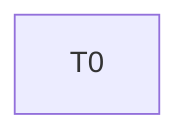
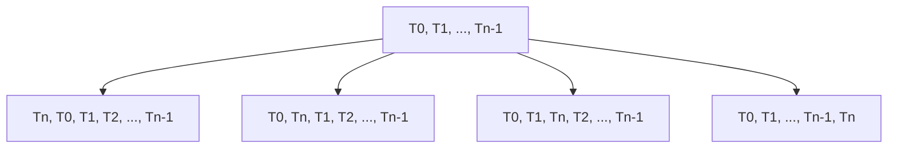
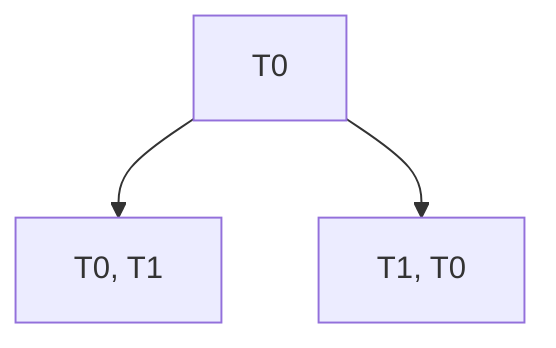
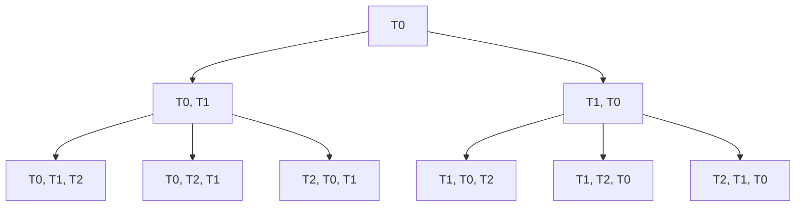

## Estructuración del problema

Empezamos describiendo el problema:
1. Tenemos que n Tablones que se busca que estén ordenados de tal forma la penalización aplicada de la suma de todos los tablones sea lo mas pequeña posible (la menor penalización posible)
2. La penalización esta descrita por la formula $CRF^{\Pi}[i] = p_i \cdot \max\left\{0, (t^*_{\Pi}(i) + tr_i) - ts_i\right\}$.
$$CRF^{\prod} = \sum_{i = 0}^{n} p_i \cdot \max\left\{0, (t^*_{\Pi}(i) + tr_i) - ts_i\right\}$$
3. Se busca implementar una subestructura optima que calcule la permutación de tablones (programación), para la que la penalización es la mínima posible, con una solución ingenua aproximada de $O(2^n)$, y una

Podemos empezar desde una Finca de tamaño 1. Para esta finca solo existe una programación optima que es solamente el tablón 0. 
$$\prod = ⟨π0⟩$$

Posteriormente podemos agregar otro tablón al problema. Quedándonos una Finca de tamaño 2. Para esta finca existen 2 posibles programaciones, que dependen del orden en que se manejen los tablones.
$$1\prod = ⟨π0, π1⟩  ,  2\prod = ⟨π1, π0⟩$$

Y así sucesivamente podemos agregar tablón a tablón y determinar que la cantidad de programaciones posibles crece a una velocidad de $2^n$, siendo $n$ el numero del tablón final.

Con este enfoque es posible ver una estructuración del problema:

**Caso base:** $F = ⟨T_0⟩$, finca con un solo elemento.
		Mejor programación: $\prod = ⟨π0⟩$

**Caso siguiente:** $F = ⟨T_0, T_1⟩$, finca con 2 elementos.
		Mejor programación:$\prod = min(CRF^{0\prod}, CRF^{1\prod})$
		Esta determinada por el mínimo entre el costo que genera la permutación 0 y la permutación 1.


**Caso n tablones:** $F = ⟨T_0, T_1, \dots, T_n⟩$, finca con $n$ elementos.
		Mejor programación:
$$\prod = min(CRF^{0\prod}, CRF^{1\prod}, \dots, CRF^{n\prod})$$
	Esta determinado por el costo mínimo de todas las permutaciones desde 0 hasta $n$.
## Solución ingenua

Partiendo de la estructuración del problema podemos definir una solución ingenua. Para cada nivel del árbol se adiciona un tablón en cada una de las posiciones factibles de este y y se calcula su costo.

**Caso base:** $F = ⟨T_0⟩$, finca con un solo elemento.
		Mejor programación:


**Caso general:** $F = ⟨T_0, T_1, \dots, T_n⟩$, finca con $n$ elementos.
		Mejor programación:




### Ejemplo con Finca tamaño 3

$$F = ⟨T_0, T_1, T_2⟩$$
**Primer caso:**


**Segundo caso:**



**Tercer caso:**


Teniendo así para este ejemplo un total de 8 subproblemas. Para los cuales se les calcula el costo de penalización de cada uno.


## Sub estructura optima

Ahora vamos a definir la subestructura optima Teniendo en cuenta la estructuración base y la solución ingenua.

**La solución óptima para k tablones contiene dentro de sí la solución óptima para k-1 tablones.**

### Caracterización Matemática

Sea $S_k$ = solución óptima para los primeros k+1 tablones ${T_0, T_1, \dots, T_k}$

**Propiedad de subestructura óptima**:

$S_k = \text{insertar } T_k \text{ en la posicion optima dentro de } S_{k-1}$

Donde $S_{k-1}$ es la **solución óptima** para los primeros k tablones.

### Formulación Recursiva

#### Definición de Estados

- **Estado**: Conjunto de tablones ya programados
- **Subproblema**: Encontrar la permutación óptima para un subconjunto de tablones

### Relación de Recurrencia

Para el conjunto de tablones $C = {T_0, T_1, \dots, T_{k-1}}$ y un tablón nuevo añadido $T_k$:

- $C$ = conjunto de tablones ${T_0, T_1, \dots, T_{k-1}}$.
- $C_{\text{per}}[T_k]$ = conjunto de todas las permutaciones posibles al insertar $T_k$ en $C$.
- $C[T_k] \in C_{\text{per}}[T_k]$ = una permutación específica con $T_k$ insertado.
- $\text{CRF}^{C[T_k]}$ = costo de la permutación $C[T_k]$.
Así definimos el la formula recursiva:

$$S_k = 
\left\{
\begin{array}{ll}
\text{CRF}^{\Pi}[0] & k = 0 \\
\min \left\{ \text{CRF}^{C[T_k]} \mid C[T_k] \in C_{\text{per}}[T_k] \right\} & k > 0
\end{array}
\right.$$


- Para $k=0$: $\text{CRF}^{\Pi}[0] = 0$ (un solo tablón, sin penalización).
- Para $k>0$: Se toma el mínimo sobre **todas las programaciones posibles**.
### Implementación de una matriz para el problema

Vamos a implementar para guardar los resultados. Una matriz donde para cada iteración de $k$ actualizamos los valores de $T_0, T_1, T_2, \dots, T_k$ con sus respectivas posiciones en un arreglo solución,


#### Explicación:

| K   | 0   | 1   | 2   | 3   | ... | N   |
| --- | --- | --- | --- | --- | --- | --- |
| T   | 0   | 1   | 1   | 1   |     |     |
| T   |     | 0   | 2   | 2   |     |     |
| T   |     |     | 0   | 0   |     |     |
| T   |     |     |     | 3   |     |     |
| ... |     |     |     |     |     |     |
| TN  |     |     |     |     |     |     |

Entonces en la iteración k = 2, el orden de los tablones es = $T_1, T_2, T_0$, gracias a sus respectivos valores en el arreglo.
### **Ejemplo**
$$
F_1 = \langle \langle 10,3,4 \rangle, \langle 5,3,3 \rangle, \langle 2,2,1 \rangle, \langle 8,1,1 \rangle, \langle 6,4,2 \rangle \rangle
$$
---
**Paso 1  $S_0$**

Solo hay un tablón $T_0$.
$S_0 = [0]$


Costo:
$CRF[0] = 4 \cdot \max\{0, (0 + 3) - 10\} = 0$

---
**Paso 2  $S_1$**

Agregamos $T_1$.
Candidatos al insertar $T_1$ en todas las posiciones de $S_0$:

- $[1, 0]$ Evaluación:

$$
\begin{aligned}
T_1(0) &: 3 \cdot \max(0, 3 - 5) = 0 \\
T_0(3) &: 4 \cdot \max(0, 6 - 10) = 0
\end{aligned}
$$

Costo total = 0.


- $[0, 1]$ Evaluación:

$$
\begin{aligned}
T_0(0) &: 4 \cdot \max(0, 3 - 10) = 0 \\
T_1(3) &: 3 \cdot \max(0, 6 - 5) = 3 \\

\end{aligned}
$$

Costo total = 3.

**Mejor costo**
$S_1 = [1, 0]$, Costo = 0


---
**Paso 3 – $S_2$**

Agregamos $T_2$.
Insertamos $T_2$ en todas las posiciones de $S_1 = [1, 0]$:

- $[2, 1, 0]$ Evaluación:
$$\begin{aligned}
T_2(0) &: 1 \cdot \max(0, 2 - 2) = 0 \\
T_1(2) &: 3 \cdot \max(0, 5 - 5) = 0 \\
T_0(5) &: 4 \cdot \max(0, 8 - 10) = 0
\end{aligned}$$
Costo = 0

- $[1, 2, 0]$ Evaluación
$$\begin{aligned}
T_1(0) &: 3 \cdot \max(0, 3 - 5) = 0 \\
T_2(3) &: 1 \cdot \max(0, 5 - 2) = 3 \\
T_0(5) &: 4 \cdot \max(0, 8 - 10) = 0
\end{aligned}$$
Costo = 3

- $[1, 0, 2]$ Evaluación
$$\begin{aligned}
T_1(0) &: 3 \cdot \max(0, 3 - 5) = 0 \\
T_0(3) &: 4 \cdot \max(0, 6 - 10) = 0 \\
T_2(6) &: 1 \cdot \max(0, 8 - 2) = 6 
\end{aligned}$$
Costo = 6


**Mejor costo:**
$S_2 = [2, 1, 0]$, Costo = 0

---

**Paso 4 $S_3$**

Agregamos  $T_3 = \langle 8, 1, 1 \rangle$  
Insertamos $T_3$ en todas las posiciones posibles:  $S_2 = [2, 1, 0]$


- $[3, 2, 1, 0]$ Evaluación:
$$\begin{aligned}
T_3(0) &: 1 \cdot\max(0, 1 - 8) = 0 \\
T_2(1) &: 1 \cdot \max(0, 3 - 2) = 1 \\
T_1(3) &: 3 \cdot \max(0, 6 - 5) = 3 \\
T_0(6) &: 4 \cdot \max(0, 9 - 10) = 0
\end{aligned}
$$
Costo = 4

- $[2, 3, 1, 0]$ Evaluación:
$$\begin{aligned}
T_2(0) &: 1 \cdot \max(0, 2 - 2) = 0 \\
T_3(2) &: 1 \cdot \max(0, 3 - 8) = 0 \\
T_1(3) &: 3 \cdot \max(0, 6 - 5) = 3 \\
T_0(6) &: 4 \cdot \max(0, 9 - 10) = 0
\end{aligned}
$$
Costo = 3


- $[2, 1, 3, 0]$ Evaluación:

$$\begin{aligned}
T_2(0) &: 1 \cdot \max(0, 2 - 2) = 0 \\
T_1(2) &: 3 \cdot \max(0, 5 - 5) = 0 \\
T_3(5) &: 1 \cdot \max(0, 6 - 8) = 0 \\
T_0(6) &: 4 \cdot \max(0, 9 - 10) = 0
\end{aligned}
$$
Costo = 0

- $[2, 1, 0, 3]$ Evaluación:
$$\begin{aligned}
T_2(0) &: 1 \cdot \max(0, 2 - 2) = 0 \\
T_1(2) &: 3 \cdot \max(0, 5 - 5) = 0 \\
T_0(5) &: 4 \cdot \max(0, 8 - 10) = 0 \\
T_3(8) &: 1 \cdot \max(0, 9 - 8) = 1
\end{aligned}$$
Costo = 1


**Mejor costo:**
$S_3 = [2, 1, 3, 0]$, Costo = 0

---

**Paso 5 $S_4$**
Agregamos $T_4 = \langle 6, 4, 2 \rangle$ a $[2, 1, 3, 0]$.
Insertamos $T_4$ en todas las posiciones posibles:  $S_3 = [2, 1, 3, 0]$

- $[4, 2, 1, 3, 0]$ Evaluación:
$$\begin{aligned}
T_4(0) &: 2 \cdot \max(0, 4 - 6) = 0 \\
T_2(4) &: 1 \cdot \max(0, 6 - 2) = 4 \\
T_1(6) &: 3 \cdot \max(0, 9 - 5) = 12 \\
T_3(9) &: 1 \cdot \max(0, 10 - 8) = 2 \\
T_0(10) &: 4 \cdot \max(0, 13 - 10) = 12
\end{aligned}
$$
Costo = 30

- $[2, 4, 1, 3, 0]$ Evaluación:
$$\begin{aligned}
T_2(0) &: 1 \cdot \max(0, 2 - 2) = 0 \\
T_4(2) &: 2 \cdot \max(0, 6 - 6) = 0 \\
T_1(6) &: 3 \cdot \max(0, 9 - 5) = 12 \\
T_3(9) &: 1 \cdot \max(0, 10 - 8) = 2 \\
T_0(10) &: 4 \cdot \max(0, 13 - 10) = 12
\end{aligned}
$$
Costo = 26

- $[2, 1, 4, 3, 0]$ Evaluación:
$$\begin{aligned}
T_2(0) &: 1 \cdot \max(0, 2 - 2) = 0 \\
T_1(2) &: 3 \cdot \max(0, 5 - 5) = 0 \\
T_4(5) &: 2 \cdot \max(0, 9 - 6) = 6 \\
T_3(9) &: 1 \cdot \max(0, 10 - 8) = 2 \\
T_0(10) &: 4 \cdot \max(0, 13 - 10) = 12
\end{aligned}
$$
Costo = 20

- $[2, 1, 3, 4, 0]$ Evaluación:
$$\begin{aligned}
T_2(0) &: 1 \cdot \max(0, 2 - 2) = 0 \\
T_1(2) &: 3 \cdot \max(0, 5 - 5) = 0 \\
T_3(5) &: 1 \cdot \max(0, 6 - 8) = 0 \\
T_4(6) &: 2 \cdot \max(0, 10 - 6) = 8 \\
T_0(10) &: 4 \cdot \max(0, 13 - 10) = 12
\end{aligned}
$$
Costo = 20

- $[2, 1, 3, 0, 4]$ Evaluación:
$$\begin{aligned}
T_2(0) &: 1 \cdot \max(0, 2 - 2) = 0 \\
T_1(2) &: 3 \cdot \max(0, 5 - 5) = 0 \\
T_3(5) &: 1 \cdot \max(0, 6 - 8) = 0 \\
T_0(6) &: 4 \cdot \max(0, 9 - 10) = 0 \\
T_4(9) &: 2 \cdot \max(0, 13 - 6) = 14
\end{aligned}
$$
Costo = 14

**Mejor costo:**
$S_4 = [2, 1, 3, 0, 4]$, Costo = 14


**Tabla**
$S_4 = [2, 1, 3, 0, 4]$, Costo = 14

| K   | 0   | 1   | 2   | 3   | 4   |
| --- | --- | --- | --- | --- | --- |
| T   | 0   | 1   | 2   | 2   | 2   |
| T   |     | 0   | 1   | 1   | 1   |
| T   |     |     | 0   | 3   | 3   |
| T   |     |     |     | 0   | 0   |
| T   |     |     |     |     | 4   |

## Complejidad
```java
public int[][] roPD(int[][] Finca) {
        int n = Finca.length;
        //Retorna vacio si la finca esta vacia
        if (n == 0) return new int[0][0];
        
        int[] mejorOrden = new int[n];
        int tamañoActual = 1;
        mejorOrden[0] = 0;
    
	    // Bucle #1 O(n)
        for (int k = 1; k < n; k++) {
            int[] ordenAnterior = Arrays.copyOf(mejorOrden, tamañoActual);
            long mejorCosto = Integer.MAX_VALUE;
            int[] mejorOrdenActual = null;
            
            // Bucle #2 O(n)
            for (int pos = 0; pos <= tamañoActual; pos++) {
            
	            // funcion insertarEnPosicion
                int[] nuevoOrden = insertarEnPosicion(ordenAnterior, k, pos, tamañoActual);
                // funcion calcularCosto
                long costo = calcularCosto(Finca, nuevoOrden);
                
                if (costo < mejorCosto) {
                    mejorCosto = costo;
                    mejorOrdenActual = nuevoOrden;
                }
            }
            
            mejorOrden = mejorOrdenActual;
            tamañoActual++;
        }
        
        // Calcular costo fuera del for
        long costoFinal = calcularCosto(Finca, mejorOrden);
        return new int[][]{mejorOrden, new int[]{(int)costoFinal}};
    }

    private int[] insertarEnPosicion(int[] array, int elemento, int posicion, int tamaño) {
        int[] nuevo = new int[tamaño + 1];
        
        if (posicion > 0) {
            System.arraycopy(array, 0, nuevo, 0, posicion);
        }
        
        nuevo[posicion] = elemento;
        
        if (posicion < tamaño) {
            System.arraycopy(array, posicion, nuevo, posicion + 1, tamaño - posicion);
        }
        
        return nuevo;
    }
```

Para calcular la complejidad de la función **roPD** debemos conocer la complejidad de 2 funciones auxiliares $I(n) = insertarEnPosicion()$ y $C(n) = calcularCosto()$.

Calculamos la complejidad temporal por ahora:

Podemos notar que las 2 funciones se ejecutan en la parte interna del doble bucle, el primer bucle itera desde $k=0$ hasta $n$; el segundo bucle itera desde $pos = 0$ hasta una variable de tamaño actual, podemos ver que en el código esta variable va aumentando junto con el primer bucle desde 0 hasta $n$, de esta forma podemos decir que en la ultima iteración del primer bucle, el segundo bucle itera hasta $n$ también.

$T(n) = \sum_{k=0}^{n} \sum_{pos=0}^{tamanoActual} (I(n) + C(n))$

Por tanto:

$T(n) = \sum_{k=0}^{n} \sum_{pos=0}^{n} (I(n) + C(n))$
### $I(n) = insertarEnPosicion()$

``` java
private int[] insertarEnPosicion(int[] array, int elemento, int posicion, int tamaño) {
        int[] nuevo = new int[tamaño + 1];
        
        if (posicion > 0) {
            System.arraycopy(array, 0, nuevo, 0, posicion);
        }
        
        nuevo[posicion] = elemento;
        
        if (posicion < tamaño) {
            System.arraycopy(array, posicion, nuevo, posicion + 1, tamaño - posicion);
        }
        
        return nuevo;
    }
```

Para determinar la complejidad de esta función es necesario conocer la complejidad temporal de el método interno utilizado: **$System.arraycopy$**, este se encarga de generar una copia del Array enviado con especificaciones. Esto conlleva una complejidad temporal de $T(n) = O(k)$ siendo k el tamaño del arreglo que se envía, siendo el tamaño máximo determinado por la función anterior, entonces el valor mas alto que puede tomar $k = n$.
Por lo tanto $I(n) = O(n)$

### $C(n) = calcularCosto()$

```java
/*Metodo para calcular el costo de una programación */

 public long calcularCosto(int[][] Finca, int[] programacion){
	int costoTotal = 0;
	int tiempoRiego = 0;

	// Se itera el bucle for desde i = 0 hasta n   O(n)
	for (int i = 0; i < programacion.length; i++){

		int tablon = programacion[i];
		long ts = Finca[tablon][0];
		long tr = Finca[tablon][1];
		long pi = Finca[tablon][2];

		long penalizacion = (tiempoRiego - ts + tr);

		if ( penalizacion > 0){
			costoTotal += penalizacion * pi;
		}else{
			costoTotal += 0;
		}
		tiempoRiego += tr;
	}
	return costoTotal;

}
```

La complejidad esta determinada por el bucle **for** que itera desde i = 0 hasta n. Dando así una complejidad de $O(n)$.

Por lo que el valor de $C(n) = O(n)$

Ahora con los valores calculados remplazamos en la ecuación:
$T(n) = \sum_{k=0}^{n} \sum_{pos=0}^{n} (n + n)$
$T(n) = \sum_{k=0}^{n} \sum_{pos=0}^{n} 2n$
$T(n) = 2n \sum_{k=0}^{n} \sum_{pos=0}^{n} 1$
$T(n) = 2n \sum_{k=0}^{n} n$
$T(n) = 2n \cdot n \sum_{k=0}^{n} 1$
$T(n) = 2n \cdot n \cdot n$
$T(n) = 2n^3$

**Complejidad final:**
$$T(n) = O(n^3)$$

## Corrección


